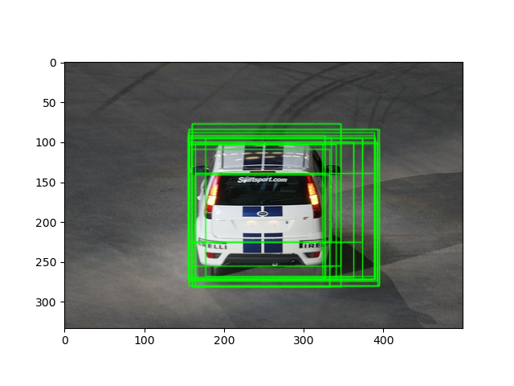
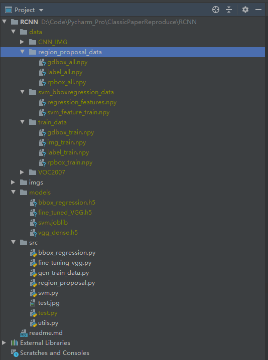

# RCNN
## 1.数据准备
### 1.1 数据集
使用VOC2007的目标检测数据集。下载地址[VOC2007](http://host.robots.ox.ac.uk/pascal/VOC/voc2007/#devkit)。目标检测任务使用到的为Anotation文件夹下的标注文件，以及Imageset/main/train.txt和test.txt用来指示哪些图片用于训练，哪些图片用于测试。
### 1.2 Pretrained VGG
使用tensorflow自带的VGG16模型`keras.applications.vgg16`，由imagenet数据集训练得出。

# 2 R-CNN结构与代码逻辑
RCNN主体由部分组成
Region Proposal + CNN + SVM + Bounding box Regression + NMS(仅在推理时用) 
## 2.1 Region Proposal
原文Region Proposal 采用selective search算法，复现代码里selective search使用opencv里的实现，需要安装opecv contrib模块，pip install opencv-contrib-python 
使用selsective search生成的候选框如下（未显示背景框，即IoU<0.6的region）

## 2.2 Finue-tuning CNN
### 2.2.1 Data for fine-tuning
RCNN使用two-stage方法，首先得出region proposal，然后使用CNN来进行特征提取。Region Proposal使用
Selective Search方法得出。每一张图片大约会得到2000个region，在训练CNN时需要对这2000个region进行标注，
并且将region resize到CNN网络规定的输入大小。在对region进行标注时，使用以下方式进行label的标注：
对每一个候选框region，计算其与ground truth的IoU指标，若IoU指标大于规定阈值(采用0.7)，则认为该候选框包含物体，且
label为ground truth的label（positive sample）。否则，将该候选框标签设为背景（negative sample）。对所有图片得到的候选框进行标注，得到用于fine-tunning CNN网络的训练数据集。
为了方便起见，我们首先将标注好的图片做成数据集存储下来，再由CNN训练时进行调用

### 2.2.2 Fine-tunning
使用2.1节生成的训练数据来对预训练的模型进行fine-tunning。复现代码使用vgg网络，由于实验设备限制，这里的复现只fine-tuning FC层（原文对整个CNN进行了fine-tuning），减小计算量。fine-tuning时，需要将预训练模型进行更改，将原来1000-way的输出改为21-way的输出，21 = 20 real label + 1 background。

## 2.3 Category-specific SVM
原文对每一类构造了一个SVM来进行是否含有相应物体的判断，复现代码使用SVM库中的linearSVC，直接对multi-class进行SVM分类。

## 2.4 Bounding box regression
复现代码使用线性回归来作为Bounding box regressor。Bounding box regression的输入与SVM的输入相同，都为fine-tuning后的vgg模型倒数第二层FC层的特征向量，需要注意的是，原文中对于Bounding box的回归使用的是pool5的特征向量，这里我们为了减少中间数据的存储，让SVM和BBox Regression共用训练数据。

## 2.5 NMS
再推理时，首先通过ss得到多个候选框，使用VGG+SVM+BBox Regression得到多个含有物体的经过回归后的box，推理的最后一步使用NMS算法对这些box进行一个去重，得到最终的识别框及其对应类别。

## 2.6实验结果与问题
实验结果存在以下问题，对于背景的检测不准确，猜测有连个原因，一是没有做hard negative mining。导致模型对背景的学习不准确，出现了很多与ground truth有较多交叉的hard negative sample没能正确区分出来。
4。二是原文对每一个类别做了一个class-specific的SVM，而复现处于方便，直接调的库，使用的one-vs-rest的SVM。
# 3 项目结构

## 3.1 data/
用于存储生成的中间结果文件

`train_data/`: 存储用于fine-tuning VGG16， 训练SVM和Bounding box regressor的数据。

`train_data/rpbox_train.npy`: 采样后的region proposal, shape=[-1, 4]，四个维度分别指代x_min, y_min, x_max, y_max.

`train_data/gdbox_train.npy`: 与采样后的region proposal对应的真实box，数据格式信息与gdbox先沟通呢

`train_data/label_train.npy`: 与采样后的region proposal对应的分类标签，shape=[-1, 1]

`train_data/img_train.npy`: 与采样后的region proposal对应的实际图片的np数组，shape=[-1, 224, 224, 3]，region proposal被resize到vgg16网络需要的大小

`CNN_IMG/`: 存储用于采用后的region proposal 对应的实际图片

`region_proposal_data/`: 存储最初从图片中使用ss算法生成的提议区域以及对应标签，
`region_proposal_data/rpbox_all`: 提议区域，shape=[-1, ]shape=[-1, 1, 1, 1, 1]，四个维度分别指代x：中心横坐标，y：中心纵坐标，w:rp的宽度，h：rp的高度。
`region_proposal_data/gdbox_all`：rp对应的真实区间的box。数据形式与rpbox相同。
`region_proposal_data/label_all`: region proposal对应的标签，shape=[-1, 2]，两个维度分别为图片名和图片分类标签

`region_proposal_data/VOC2007/`: VOC2007数据集原始文件

## 3.2 src/
存储源代码

`region_proposal.py` 生成region_proposal_data中的文件

`gen_train_data.py` 生成用于fine-tuning的训练数据

`fine_tuning_vgg.py` 迁移学习vgg16模型用于目标检测

`svm.py`              用于根据feature对object进行分类的SVM训练

`bbox_regression.py`  训练模型用于bounding box regression

`utils.py`            工具包，计算iou等

`test.py`           实际进行目标检测的代码，对目标图片检测物体并识别

## 3.3 models/
用于存储生成的推理时需要的各种模型

`bbox_regression.h5`：bounding box regressor

`fine_tuned_VGG.h5`：vgg16 for object detection

`svm.joblib`：svm for classification

`vgg_dense.h5`：fisrt dense layer ouput of vgg 16(features)

## 3.4 imgs/
存储此文档所需的图片

